# Cold-run naming order — the wave scheduler

How the FIRST version of a bundle (a cold run, no prior version) is processed:
how functions are ordered and queued for LLM naming.

As of main a7566237 (2026-09-28). Default = relaxed schedule; --sequential
shows the conservative variant.

## Walk-through: one function, graph entry to applied rename

Follow one caller `F` (say at `input.js:120:4`). The beautified file is parsed
and `F` becomes a graph row in traversal order; the naming graph records its
dependencies — internal callees plus scope parent — so callees are named
before the functions that call them, and leaf functions form wave 1 in graph
order. When `F`'s wave comes, its eligible bindings are collected, its context
built with callee signatures printed under the names its callees already won,
and its identifiers split into lanes of at most 25. Each lane asks the model
in windows, validating every suggestion against the names frozen at round
start and claiming winners locally without touching scope state. The barrier
then sorts all claims (node, phase, binding, sequence), applies the winners
through validated rename in that order, and rejects collisions — those come
back as retry seeds in the next wave's round A. Still inside the barrier,
`F`'s shadowed block bindings are uniquified (`x_2`, `x_3`), and — on the
default relaxed schedule — the shadowed pass (round B) is stashed to ride with
the next wave's round A, so `F` settles only after that runs; the next wave's
prompts then see every one of `F`'s new names.

Solid edges below are the DEFAULT (relaxed) path; dotted edges are the
`--sequential` variant.

```mermaid
flowchart TD
    subgraph BEFORE["Before naming: pipeline stages 1 to 8"]
        IN["Read the bundle, detect bundler and minifier (stages 1-2)"]
        UP["Unpack the bundle, vendor files named inside (stages 3-5)"]
        LIB["Detect library files (stage 4)"]
        FMT["Beautify each file with the native formatter (stage 6)"]
        PREV{"A prior humanified version exists?"}
        COLD["Cold era: parse the beautified file, freeze library, eval-tainted and wrapper functions (fresh_era)"]
        NOTE["Frozen functions start settled and never enter the waves (pre_transfer_states)"]
        GRAPH["Build the function graph: every function and module-level binding, in traversal order (build_unified_graph)"]
        NGRAPH["Build the naming graph: node order plus dependency edges to callees, scope parent, classes (build_naming_graph)"]
        IN --> UP
        UP --> LIB
        LIB --> FMT
        FMT --> PREV
        PREV -- "no: first version" --> COLD
        PREV -- "yes" --> PRIOR["Stage 8: match the prior, transfer names, then the same waves - not this diagram"]
        COLD --> NOTE
        COLD --> GRAPH
        GRAPH --> NGRAPH
    end

    PRIOR --> NGRAPH
    NGRAPH --> LOOP{"Anything left: pending nodes, retry seeds, deferred shadowed lanes? (wave_loop)"}
    LOOP -- "no" --> DONE["Naming hands over: library-prefix pass, naming floor, generate"]
    LOOP -- "yes" --> T0{"Any pending node has ALL dependencies settled? (tier 0)"}
    T0 -- "yes" --> TAKE["Take those nodes, in graph order (wave_members)"]
    T0 -- "no" --> T1{"Any node ready when scope-parent edges are ignored? (tier 1)"}
    T1 -- "yes" --> TAKE
    T1 -- "no: deadlock break" --> ALL["Take every pending node"]

    subgraph WAVEK["Wave k, round A: every ask reads FROZEN names and only collects"]
        DEF["Wave k-1 round-B lanes join first (defer-shadowed, default only)"]
        FN["Each ready function: keep eligible bindings, build naming context, register phase 0"]
        SPLIT{"window-lanes lever on? (default yes)"}
        L25["Default: one lane per window, at most 25 identifiers each"]
        LSEQ["--sequential: one lane for up to 25 bindings, else 4, 8 or 16 lanes, each walking its windows in sequence"]
        MB["Module-level bindings: groups of at most 10 within 100 lines, 15 for esbuild"]
        RETRY["Re-ask the last wave barrier losers (retry seeds, one ask each)"]
        ASK["One ask: a window of at most 25 identifiers, halved while the answer truncates"]
        VD{"Suggestion valid against frozen names?"}
        CLAIM["Claim the winner locally, scope state untouched until the barrier"]
        MORE{"Lane still has work: next window, per-identifier retry, straggler pass?"}
        TAIL["Lane tail: derive or decorate what remains, record identities (finish)"]
        COLL["Every claim becomes a barrier entry, in collection order"]
        TAKE --> FN
        TAKE --> MB
        ALL --> FN
        ALL --> MB
        DEF --> ASK
        FN --> SPLIT
        SPLIT -- "yes" --> L25
        SPLIT -. "no" .-> LSEQ
        L25 --> ASK
        LSEQ --> ASK
        MB --> ASK
        RETRY --> ASK
        ASK --> VD
        VD -- "valid" --> CLAIM
        VD -- "duplicate, invalid, unchanged or missing" --> MORE
        CLAIM --> MORE
        MORE -- "yes: at most 2 attempts per identifier, free retries for names claimed mid-call" --> ASK
        MORE -- "no" --> TAIL
        TAIL --> COLL
    end

    subgraph BARR["Barrier: the only writer. Runs after the answers, before anything is released"]
        BA["Barrier A: sort every entry by node, phase, binding, sequence and apply winners through validated rename"]
        OK{"Name free and scope-safe?"}
        SEED["Loser: recorded, becomes a retry seed for wave k+1 round A"]
        GATE["Gate release, still inside the barrier: compute shadowed bindings, uniquify name_2, name_3"]
        DDEF{"defer-shadowed lever on? (default yes)"}
        STASH["Default: stash round-B lanes to ride with wave k+1 round A, the function stays unsettled until then"]
        RB["--sequential: round B runs now, the shadowed pass asks and barrier B applies it"]
        SETTLE["Settle nodes with no held work, mark functions llm-done"]
        BA --> OK
        OK -- "yes: applied, live names update" --> GATE
        OK -- "no" --> SEED
        GATE --> DDEF
        DDEF -- "yes" --> STASH
        DDEF -. "no" .-> RB
        STASH --> SETTLE
        RB --> SETTLE
    end

    COLL --> BA
    SEED -.-> RETRY
    STASH -.-> DEF
    SETTLE --> LOOP
```

## Legend — every box, with its source

All paths relative to the repo root; every citation is the current code.

### Before naming

| Box    | What it is (file:line)                                                                                                                                                                           |
| ------ | ------------------------------------------------------------------------------------------------------------------------------------------------------------------------------------------------ |
| IN     | read + detect phase: `crates/humanify-cli/src/unified.rs:582`, `detect_stage` at `unified.rs:907`                                                                                                |
| UP     | stages 3-5 phase: `unified.rs:591-606` (`unpack_bundle`); stage table `docs/pipeline-stages.md:19-23`                                                                                            |
| LIB    | library-detection phase: `unified.rs:611-618` (`filter_libraries`)                                                                                                                               |
| FMT    | stage 6 per file: `unified.rs:630`, the per-file loop at `unified.rs:964`, formatter comment `unified.rs:1000`                                                                                   |
| PREV   | the naming stage entry `run_naming` (`crates/humanify-core/src/naming/driver.rs:165`), prior dispatch `driver.rs:186-198`                                                                        |
| COLD   | `fresh_era` (`crates/humanify-core/src/naming/driver/era.rs:381-430`): parse `:387`, graph `:389-397`, freezes `:402-411`, one scope epoch `:423`                                                |
| NOTE   | `pre_transfer_states` (`era.rs:411`) feeds the settled filter in `wave_loop` (`crates/humanify-core/src/naming/waves/processor.rs:554`)                                                          |
| GRAPH  | `build_unified_graph` / `build_function_graph` (`crates/humanify-core/src/graph.rs:501`, `:650`); `GraphFunction` fields incl. `internal_callees` `:55`, `scope_parent` `:59` (`graph.rs:44-70`) |
| NGRAPH | `build_naming_graph` (`crates/humanify-core/src/naming/waves/graph_ext.rs:91`); node order `:99-103`, dependency edges `:137-169`, callee insertion order `:250-290`                             |
| PRIOR  | stage 8, cold runs skip it: dispatch `driver.rs:186-196` (`match_prior_version` + `prior_era`)                                                                                                   |

### Wave loop and membership

| Box  | What it is (file:line)                                                                                            |
| ---- | ----------------------------------------------------------------------------------------------------------------- |
| LOOP | `wave_loop` (`processor.rs:552-568`), the while at `:557` keeps the loop alive for retry seeds and deferred lanes |
| T0   | tier 0 readiness, all deps settled (`processor.rs:579-584`, `wave_members` `:572-596`)                            |
| TAKE | tier-0 members in graph (pending) order (`processor.rs:579-583`)                                                  |
| T1   | tier 1, scope-parent edges ignored (`processor.rs:587-593`)                                                       |
| ALL  | deadlock break, every pending node (`processor.rs:595`)                                                           |
| DONE | after the waves: library prefix (`era.rs:509-513`), floor, generate — order in `driver.rs:7-21`                   |

### Wave k, round A (the asks)

| Box   | What it is (file:line)                                                                                                                                                                                                      |
| ----- | --------------------------------------------------------------------------------------------------------------------------------------------------------------------------------------------------------------------------- |
| DEF   | deferred round-B lanes taken first (`processor.rs:662-665`); the `deferred` field `:388-390`                                                                                                                                |
| FN    | per-function setup (`processor.rs:669-692`): owned bindings `:680`, eligibility filter `select_llm_bindings` `:682` / `:766-787`, register + lanes `start_fn_phase` `:817-864`                                              |
| SPLIT | lane-count decision (`processor.rs:840-845`): the `WindowLanes` lever path vs `compute_lane_count`                                                                                                                          |
| L25   | default: `names.len().div_ceil(batch_size)` lanes (`processor.rs:841-842`), `DEFAULT_BATCH_SIZE = 25` (`batch.rs:34`), `split_by_position` `batch.rs:88-91`                                                                 |
| LSEQ  | `--sequential`: `compute_lane_count` (`batch.rs:70-80`: 0 lanes for <= 25 bindings, else 4 / 8 / 16), threshold `batch.rs:39`                                                                                               |
| MB    | module-binding groups (`processor.rs:693-698`, `group_by_proximity` `:790-809`: at most 10 per group, 15 for esbuild)                                                                                                       |
| RETRY | retry seeds re-asked (`processor.rs:699-702`; `start_retry` `:1382`, `retry_request` `:1416`, entries `:1449-1491`)                                                                                                         |
| ASK   | the lane state machine (`batch.rs:280-344`): window take `min(adaptive, queue)` at `:302`, straggler pass `:285-299`, adaptive halving on length truncation `:377-378`; request built by `fn_request` (`processor.rs:1036`) |
| VD    | `validate` (`batch.rs:428-458`) against the round's frozen used-name set                                                                                                                                                    |
| CLAIM | `apply_valid` check-and-claim (`batch.rs:461-485`, claim `:487-494`) — local set, no scope writes                                                                                                                           |
| MORE  | `classify` (`batch.rs:497-566`): at most 2 attempts per identifier (`batch.rs:36`, gate at `:554`), free retries for names claimed mid-call `:516-528`                                                                      |
| TAIL  | `Lane::finish`, the resolution tail (`batch.rs:571-643`)                                                                                                                                                                    |
| COLL  | `collect_lane_effects` (`processor.rs:1914-1962`) — claims become barrier `Entry` rows                                                                                                                                      |

### Barrier (apply, then release)

| Box    | What it is (file:line)                                                                                                                                                     |
| ------ | -------------------------------------------------------------------------------------------------------------------------------------------------------------------------- |
| BA     | `barrier` (`processor.rs:2066-2117`): canonical sort `(node, phase, binding, seq)` at `:2069-2076`, apply `:2140-2197`, validated rename + trail `llm_rename` `:2209-2242` |
| OK     | taken-name check (`processor.rs:2083-2084`); scope safety was already checked in-lane (`batch.rs:470`)                                                                     |
| SEED   | rejections recorded (`processor.rs:2112-2114`), grouped into seeds by `build_retry_seeds` `:1494-1520`                                                                     |
| GATE   | gate release (`processor.rs:708-719`): `compute_shadowed_uniquified` `:959-985`, uniquify rename `apply_uniquify` `:988-1032` — runs inside the barrier because it mutates |
| DDEF   | the `DeferShadowed` lever check (`processor.rs:721`)                                                                                                                       |
| STASH  | `self.deferred = lanes` (`processor.rs:722`); held nodes stay unsettled (`settle_nodes` held set `:603-607`)                                                               |
| RB     | `--sequential` round B now: `drive_round` + second barrier (`processor.rs:724-725`)                                                                                        |
| SETTLE | `settle_nodes` (`processor.rs:599-642`), called with the live seeds at `:565`                                                                                              |

## Default vs --sequential

- **Default (relaxed):** `FastTier::Relaxed(Levers::all())` — both
  decision-changing levers on. Selected by `CommandOptions::fast_tier`
  (`unified.rs:107-119`, default at `:118`); the levers are
  `window-lanes` and `defer-shadowed` (`crates/humanify-core/src/fast.rs:20-32`).
- **--sequential:** `FastTier::Exact` (`unified.rs:114`) — both levers off,
  byte-identical to the pre-2026-09-28 default at the same `--batch-size`
  (`fast.rs:5-9`). Round B costs its own round inside the wave. The legacy
  batch of 10 is recovered explicitly with `--batch-size 10`
  (`batch.rs:30-34`) — batch size is a flag, not a tier property.
- **Both tiers pipelined and deterministic:** every lane's follow-up ask
  starts as soon as its own answer lands (`drive_round_pipelined`,
  `processor.rs:1595`); this is decision-neutral because a lane reads only
  the round's frozen state plus its own claims (`batch.rs:7-13`,
  `processor.rs:1531-1541`). Only `FastTier::Off` (programmatic, not the CLI)
  uses the turn-by-turn driver (`processor.rs:1544`).
- **What a wave's rounds are:** round A (phase 0, the main pass) reads the
  frozen pre-step state and collects; barrier A applies; the gate release
  computes shadowed bindings inside the barrier; round B (phase 1, the
  shadowed pass) collects; barrier B applies (`processor.rs:1-21`). Under the
  default, round B is deferred to the next wave and merges with that wave's
  round A (`processor.rs:662-665`).
