# Cross-version matching: how version N inherits version N-1's names

As of main 799499a8 (2026-09-29). Sources cited per node.

When humanify runs with `--prior-version`, it receives version N-1's humanified
output alongside the fresh minified version N. Everything the pipeline does
next is one question, asked per function, per module binding, and per top-level
statement: **is this the same thing as something in the prior version?** If
yes — carry the name mechanically. If probably — let the LLM name it, but show
it the prior. If no — name it fresh. One rule runs through the whole ladder:
**every tier abstains rather than guesses** — a wrong match costs two diffs
where a missed one costs one.

All paths below are relative to the repo root; the pipeline is the Rust binary
(`crates/`, built as `target/release/humanify`).

```mermaid
flowchart TD
  subgraph sg_ing["Prior ingestion and both-side indexing"]
    cli(["Run with --prior-version: version N-1 humanified output loaded as the prior text (loadPriorVersionCode)"])
    vend["Unpack: vendor manifest emitted in the PRIOR release order when the switch is on (ManifestPriorOrder); vendor bodies reused by content at finish (vendor-inherit)"]
    parse["Match stage parses BOTH texts, builds per side: unified graph, symbol tables, statement contexts, fingerprint indexes (matchPriorVersion)"]
    elig["Fresh side skips bundler or minifier name patterns; prior side: ALL bindings eligible"]
  end

  subgraph sg_iden["Identity: the three content keys"]
    hfn["Function identity: structuralHash - binding names slotted by resolved symbol, literals blurred to string length and number magnitude (canonicalSerialize, LiteralPolicy Blurred)"]
    hbind["Module-binding identity: fingerprintHash over the initializer subtree, literals VERBATIM (bindingFingerprintHash)"]
    hstmt["Statement identity: statementHash - every identifier masked, literals kept verbatim; whole statements equal iff same code modulo renaming (statementHash)"]
    idx["Fingerprint index: full fingerprints - features, memberKey, callee and caller shapes, callee hashes, two-hop shapes, shingle tokens - bucketed by structural hash (buildFingerprintIndex, buildBindingFingerprintIndex)"]
  end

  sane{"Same-program sanity once the cascade has run: at least 5 percent of prior functions present in N, once at least 50 exist? (assertPriorLooksLikeSameProgram)"}
  fail["FAIL FAST - the prior is a wrong file, not an aggressive refactor; the run stops rather than transfer nothing"]

  subgraph sg_ladder["Tier ladder: the exact-matching cascade"]
    buck{"Prior function's structural-hash bucket on the fresh side: how many candidates? (runMatchingPass)"}
    un0(["UNMATCHED - deleted in N, or changed past the hash"])
    sing{"Exactly 1: does a version-stable signal contradict? (singletonVerdict on memberKey, propertyAccesses, externalCalls - on the binding cascade always unguarded, binding fingerprints carry none of these)"}
    uniq(["MATCH - structuralHashUnique, no cascade rung needed"])
    casg["2 or more: disambiguation cascade in fixed order - the FIRST rung to leave ONE candidate wins (resolveMatch)"]
    r1["1 identity - correspondence under the matches so far, caller-supplied by the binding alternation (tryIdentityResolve)"]
    r2["2 memberKey - the property key it is assigned to (filterByMemberKey)"]
    r3["3 enclosing statement - equal-count bijection inside ONE statement on each side, paired by source position (tryEnclosingStatementResolve)"]
    r4["4 calleeShapes - blurred callee call shapes (filterByCalleeShapes)"]
    r5["5 callerShapes - blurred caller shapes (filterByCallerShapes)"]
    r6["6 calleeHashes then 7 twoHopShapes - exact callee hashes, then the callees of the callees (tryCalleeHashCascade)"]
    r8["8 shingleSimilarity - Jaccard overlap of edge and token shingles; needs the 0.5 floor AND a clear win over the runner-up (tryShingleResolve)"]
    one(["MATCH - credited to the rung that closed it"])
    amb(["AMBIGUOUS - parked with the pool the failing rung narrowed to; a rung that EMPTIES the pool also parks here, never falls through to weaker evidence"])
    post["Post-passes inside every FUNCTION-cascade round: injectivity demotion - two priors claiming one fresh function, both demoted; crossed-container revocation of enclosing-statement pairs whose containers matched apart; then call-graph propagation on five rungs - matched callee, matched caller, scope parent, external refs, scope ordinal (demoteNonInjectiveMatches, revokeCrossedContainers, propagate; the binding rounds use their reference-identity resolver instead)"]
    alt["Alternation: function and binding cascades re-run in rounds; each side's new matches crack the other side's ambiguous buckets by WHICH matched thing a member references (alternateFunctionAndBindingMatching)"]
    ord["Ordinal tail tier: equal counts, EVERY member still undecided, one shared evidence key - pair by source order (resolveAmbiguousByOrdinal)"]
    pool["Interchangeable pools: certified interchangeable buckets paired by anchor affinity to already-matched neighbors (assignInterchangeablePools)"]
    fin(["Final match map - prior session id to fresh session id with the closing tier, plus ambiguous and unmatched lists (MatchResult)"])
  end

  subgraph sg_close["Close matching for the changed functions"]
    clos["Close tier over everything still unmatched AFTER the ladder - unmatched and still-ambiguous alike: cosine similarity of 12 structural feature vectors, threshold 0.8, top 3 per function, greedy 1:1, exact ties ABSTAIN (findCloseMatches)"]
    algn["Each won pair aligns top-level body statements on rename-invariant content, bridging names through per-statement placeholder slots; the aligned-statement count is the pair's first corroboration signal (computeBodyLocalTransfers)"]
    corr{"Corroborated? one or more aligned statements, OR shingle overlap at the 0.5 floor (corroborate)"}
    cor(["CORROBORATED close match - signature-position pairs plus statement-aligned body locals transfer mechanically; the head name still goes to the LLM"])
    uncor(["UNCORROBORATED - no mechanical rename; the pair still carries prior context into the prompt"])
  end

  subgraph sg_twins["Statement twins"]
    twp["Proposals from three tiers: unique 1:1 statementHash join, fossil module tier, matched-reference bucket tier (computeGatedStatementTwins)"]
    twg{"Gate ladder per proposal: candidacy, statement callees, declared-name roles, structural hash plus slot mapping, per-slot owner - ABSTAIN on any failure"}
    twout(["Certified twin pairs: bridged slot renames plus private-name rewrites; outer slots become vote testimony, never exact-grade"])
  end

  subgraph sg_xfer["Transfer: applying the matched names"]
    settle["Settle before transfer: plugin freezes first - eval-with taint, wrapper IIFE, library regions - then still-pending exact matches mark their functions transferred (settle, preTransferStates)"]
    evid["Transfer evidence from the match: exact slot tables translated through placeholders, close pairs, binding-cascade renames plus function var-name transfers, prior roles (collectEvidence)"]
    t1["1 statement-twin: bridged slot renames apply BEFORE exact transfers, repairing matches the cascade cross-paired (applyStatementTwinTransfers)"]
    t2["2 exact-match: matched functions rename params, locals and own name slots from prior slot tables; references to outside bindings become exact-grade votes (applyMatchedRenames)"]
    t3["3 close-match: positional signature pairs and statement-aligned body locals apply; head names stay LLM suggestions (attachCloseMatchContext)"]
    t4["4 binding-cascade: module bindings matched by the alternation rename through validated renames; a prior that kept the exact same token settles in place (applyModuleBindingRenames)"]
    t5["5 vote-propagation: 2 agreeing votes rename module bindings and cold function heads; below the floor the single-vote pin ladder - one exact vote, one claimant, role corroboration, validated rename; closure captures at a unique top vote (propagateExternalReferences, trySingleVotePin)"]
    t6["6 close-match-suggestions: resolved names injected into close-match LLM context as HINTS, never mechanical renames (suggestFromCloseMatchExternals)"]
    t7["7 retry: collision-rejected renames re-attempted as earlier phases free tokens; swaps and chains unwind, pure cycles break via a temp name (retryRejectedTransfers)"]
    valid["Every rename goes through ONE validated applier: collisions reject, no tier overwrites another, every attempt lands on the strategy trail; a row is handled ONCE - lifecycle pending to settled (attemptValidatedRename, Lifecycle)"]
    carry(["Carry for the SPLIT: prior top-level statement texts read while the prior AST is alive, plus the final-name to prior-name map built after every pass (matcherCarry, buildPriorMatchMap)"])
  end

  subgraph sg_miss["No match: LLM naming with prior context"]
    newfn(["Fresh functions nothing claimed (findNewFunctions) - fresh naming, no prior block"])
    waves["LLM waves name everything still pending, in scope batches with already-renamed peers and a used-names list windowed by proximity in large scopes (runEra, getProximateUsedNames)"]
    pctx["Close-matched prompt block: the prior function's CODE, a flat reusable-names bag, and per-identifier hints and snaps - IMPORTANT, a prior version of this function was already named, reuse unless the purpose changed (renderPriorVersionBlock, renderPriorNameHints; the retry prompt repeats the prior block)"]
    sugg["Bindings the ladder missed: their ranked top vote attaches as a suggestedName - recorded as a vote, never applied (rankVoteSuggestion)"]
    recon["Post-generation prior-diff reconcile: diff the generated output against the prior text; hunk lines identical modulo identifier tokens propose snapping back to the prior name; tiers asymmetric, descriptive, consumer, last-resort, plus the exp088 skeleton-vote pool pairing residual changed lines by unique line skeleton (runPriorDiffReconciliation, addSkeletonVoteCandidates)"]
  end

  out(["Shipped output of version N; the carry feeds the split"])

  cli --> vend
  cli --> parse
  parse --> elig
  elig --> hfn
  elig --> hbind
  parse --> hstmt
  hfn --> idx
  hbind --> idx
  idx --> buck

  buck -->|"0 candidates"| un0
  buck -->|"exactly 1"| sing
  buck -->|"2 or more"| casg
  sing -->|"reject - signals disagree"| un0
  sing -->|"accept, or unguarded"| uniq
  casg --> r1
  r1 -->|"no unique winner"| r2
  r2 -->|"no unique winner"| r3
  r3 -->|"no unique winner"| r4
  r4 -->|"no unique winner"| r5
  r5 -->|"no unique winner"| r6
  r6 -->|"no unique winner"| r8
  r1 -->|"one left"| one
  r2 -->|"one left"| one
  r3 -->|"one left"| one
  r4 -->|"one left"| one
  r5 -->|"one left"| one
  r6 -->|"one left"| one
  r2 -->|"pool emptied - contradiction"| amb
  r6 -->|"pool emptied - contradiction"| amb
  r8 -->|"floor cleared, clear winner"| one
  r8 -->|"no clear winner"| amb
  one --> post
  uniq --> post
  amb --> post
  post --> alt
  alt --> ord
  ord --> pool
  pool --> fin

  fin --> sane
  sane -->|"fails the floor - wrong file"| fail
  sane -->|"matched"| settle
  sane -->|"unmatched plus still-ambiguous"| clos
  sane -->|"fresh side never claimed"| newfn
  clos --> algn
  algn --> corr
  corr -->|"yes"| cor
  corr -->|"no"| uncor

  hstmt -->|"the twin tiers join on it"| twp
  settle --> twp
  twp --> twg
  twg -->|"all gates pass"| twout
  settle --> evid
  twout --> t1
  evid -->|"exact slot tables"| t2
  evid -->|"close pairs"| t3
  evid -->|"binding renames"| t4
  t1 --> t2
  t2 --> t3
  t3 --> t4
  t4 -->|"external-reference testimony accumulates"| t5
  t5 --> t6
  t6 --> t7
  t7 -->|"still pending after every tier"| waves
  t2 -.-> valid
  t4 -.-> valid
  t5 -.-> valid
  t7 -.-> valid
  settle -.->|"statement texts now, match map keyed by FINAL names"| carry

  cor -->|"head name and residuals stay pending"| pctx
  uncor -->|"context only"| pctx
  newfn --> waves
  pctx -.->|"feeds the wave prompt"| waves
  sugg -.->|"feeds batch suggestions"| waves
  waves -->|"generated output is valid"| recon
  recon --> out
  carry -.->|"feeds the split"| out
```

## Legend: every box and its source

| Box                      | What it decides                                                                                                                                         | Source (file:line)                                                                                                                                                                                                                                                        |
| ------------------------ | ------------------------------------------------------------------------------------------------------------------------------------------------------- | ------------------------------------------------------------------------------------------------------------------------------------------------------------------------------------------------------------------------------------------------------------------------- |
| `cli`                    | The prior enters as TEXT: version N-1's humanified output                                                                                               | `crates/humanify-cli/src/unified.rs:1299` (loaded at :585)                                                                                                                                                                                                                |
| `vend`                   | Vendor manifest in prior-release order; vendor body reuse by content                                                                                    | `crates/humanify-cli/src/unified.rs:605` (switch); `crates/humanify-core/src/finish/vendor_inherit.rs:1`                                                                                                                                                                  |
| `parse`, `elig`          | Both sides parsed; fresh side rename-eligibility skip set, prior side ALL eligible                                                                      | `crates/humanify-core/src/prior.rs:124` (parse); :144 and :185 (eligibility)                                                                                                                                                                                              |
| `hfn`                    | Per-function identity: blurred-literal, symbol-slotted structural hash                                                                                  | `crates/humanify-core/src/hash/serialize.rs:109` (`LiteralPolicy` :42); assigned at `crates/humanify-core/src/graph.rs:53`                                                                                                                                                |
| `hbind`                  | Per-binding identity: verbatim-literal initializer subtree hash                                                                                         | `crates/humanify-core/src/graph.rs:1028` (policy at :1033)                                                                                                                                                                                                                |
| `hstmt`                  | Per-statement identity: all-identifiers-masked, literals verbatim                                                                                       | `crates/humanify-core/src/hash/statement_hash.rs:190` (rules :1-16)                                                                                                                                                                                                       |
| `idx`                    | Buckets + full fingerprints both kinds, functions and hashable bindings                                                                                 | `crates/humanify-core/src/matching.rs:488` (:586 bindings)                                                                                                                                                                                                                |
| `sane`, `fail`           | Wrong-file refusal: 5 percent presence floor past 50 functions, checked once the cascade has run                                                        | `crates/humanify-core/src/prior.rs:9-42`, called at :291                                                                                                                                                                                                                  |
| `buck`                   | Bucket sizing per prior row                                                                                                                             | `crates/humanify-core/src/matching/cascade.rs:1163` (`candidatesForHash` :1149)                                                                                                                                                                                           |
| `un0`                    | Zero-corroboration refusal                                                                                                                              | `crates/humanify-core/src/matching/cascade.rs:1175`                                                                                                                                                                                                                       |
| `sing`                   | Singleton guard; on bindings always `unguarded` (no memberKey, no features on binding fingerprints)                                                     | `crates/humanify-core/src/matching/cascade.rs:1092`; binding shape `crates/humanify-core/src/matching.rs:204-211`                                                                                                                                                         |
| `uniq`                   | Singleton accept = structuralHashUnique                                                                                                                 | `crates/humanify-core/src/matching/cascade.rs:1181-1207`                                                                                                                                                                                                                  |
| `casg`                   | The ladder; ORDER IS LOAD-BEARING                                                                                                                       | `crates/humanify-core/src/matching/cascade.rs:928`                                                                                                                                                                                                                        |
| `r1` identity            | Caller-supplied resolver, first rung                                                                                                                    | `crates/humanify-core/src/matching/cascade.rs:712` (invoked :944)                                                                                                                                                                                                         |
| `r2` memberKey           | Filter; empty pool = contradiction                                                                                                                      | `crates/humanify-core/src/matching/cascade.rs:521` (invoked :949)                                                                                                                                                                                                         |
| `r3` enclosing stmt      | Equal-count bijection, one statement per side, source-position pairing                                                                                  | `crates/humanify-core/src/matching/cascade.rs:839`                                                                                                                                                                                                                        |
| `r4`, `r5` shapes        | Blurred callee / caller shape filters                                                                                                                   | `crates/humanify-core/src/matching/cascade.rs:537`, :546                                                                                                                                                                                                                  |
| `r6` calleeHashes/twoHop | Exact hashes then two-hop shapes; each can contradict                                                                                                   | `crates/humanify-core/src/matching/cascade.rs:672`                                                                                                                                                                                                                        |
| `r8` shingles            | Jaccard tie-break, floor 0.5, strict win over runner-up                                                                                                 | `crates/humanify-core/src/matching/cascade.rs:612`; floor `crates/humanify-core/src/matching.rs:465`                                                                                                                                                                      |
| `one`, `amb`             | Rung exits: exactly-one = match; contradiction or still-2+ = ambiguous                                                                                  | `crates/humanify-core/src/matching/cascade.rs:957-1066`                                                                                                                                                                                                                   |
| `post`                   | Injectivity demotion, crossed-container revocation, propagation (5 rungs) inside every function-cascade round; binding rounds use the identity resolver | `crates/humanify-core/src/matching/cascade.rs:1235`, :1308; `crates/humanify-core/src/propagation.rs:1-28`; propagation wired at `cascade.rs:1388` and enabled for the pipeline at `prior.rs:227` and `alternation.rs:692-701` (binding rounds: `alternation.rs:277-286`) |
| `alt`                    | Function and binding cascades alternate rounds; reference-identity resolver                                                                             | `crates/humanify-core/src/matching/alternation.rs:647` (invoked `prior.rs:233`)                                                                                                                                                                                           |
| `ord`                    | Ordinal pairing tail tier, FUNCTION result only, after alternation                                                                                      | `crates/humanify-core/src/matching/cascade.rs:1496` (invoked `prior.rs:262`)                                                                                                                                                                                              |
| `pool`                   | Certified interchangeable pools, anchor-affinity assignment                                                                                             | `crates/humanify-core/src/matching/cascade.rs:1696` (invoked `prior.rs:263`)                                                                                                                                                                                              |
| `fin`                    | `MatchResult`: matches keyed by PRIOR session id, ordered ambiguous map, unmatched list                                                                 | `crates/humanify-core/src/matching/cascade.rs:369`                                                                                                                                                                                                                        |
| `clos`                   | Close candidates = every id NOT in the final matches (both unmatched and still-ambiguous); cosine 0.8, top-3, tie-abstaining greedy                     | `crates/humanify-core/src/matching/close_dump.rs:113-130`; `crates/humanify-core/src/matching/close.rs:189` (threshold :65, greedy :297, tie mutual abstention :333)                                                                                                      |
| `algn`                   | Statement-level alignment of close pairs: same-hash groups, declaration anchor, unanimity, nested-function skip                                         | `crates/humanify-core/src/matching/statement_align.rs:1006` (gates :13-24)                                                                                                                                                                                                |
| `corr`, `cor`, `uncor`   | Alignment-first corroboration, shingle fallback; uncorroborated pairs carry context but no transfers                                                    | `crates/humanify-core/src/matching/close.rs:389` (buckets :371); `close_dump.rs:89-101`                                                                                                                                                                                   |
| `twp`, `twg`, `twout`    | Three proposal tiers + gate ladder; bridged slot renames + private rewrites; outer refs non-exact                                                       | `crates/humanify-core/src/twins/gates.rs:1640` (gates :5-26); inventories `crates/humanify-core/src/twins.rs:191`                                                                                                                                                         |
| `settle`                 | The ONE owner of twin inputs: freezes, then exact-match marks                                                                                           | `crates/humanify-core/src/rename/transfer/stage.rs:203` (:248 freezes, :59 apply)                                                                                                                                                                                         |
| `evid`                   | Exact tables, close infos, binding renames, prior roles, fn matches                                                                                     | `crates/humanify-core/src/rename/transfer/evidence.rs:167` (:144 struct)                                                                                                                                                                                                  |
| `t1`                     | Twin transfers apply first, reordering vs the old diagram: BEFORE exact                                                                                 | `crates/humanify-core/src/rename/transfer/tiers.rs:52`; registry `crates/humanify-core/src/rename/transfer.rs:235`                                                                                                                                                        |
| `t2`                     | Exact slot pairs; owned vs external routing                                                                                                             | `crates/humanify-core/src/rename/transfer/tiers.rs:123` (:174)                                                                                                                                                                                                            |
| `t3`                     | Close pairs: positional + aligned-body transfers; head stays LLM; still-pending only                                                                    | `crates/humanify-core/src/rename/transfer/tiers.rs:139`                                                                                                                                                                                                                   |
| `t4`                     | Binding-cascade renames through validated renames; same-name settle                                                                                     | `crates/humanify-core/src/rename/transfer/tiers.rs:333` (:369)                                                                                                                                                                                                            |
| `t5`                     | Vote floor (2), single-vote pin ladder, closure captures; module + function-name ladders                                                                | `crates/humanify-core/src/rename/votes.rs:232` (floor :52, pin :139, closures :614); function pins exclude close matches :569                                                                                                                                             |
| `t6`                     | Set-elimination suggestions from close externals                                                                                                        | `crates/humanify-core/src/rename/transfer/tiers.rs:397`                                                                                                                                                                                                                   |
| `t7`                     | Deferred retry of collision-rejected renames                                                                                                            | `crates/humanify-core/src/rename/transfer/retry.rs:121`                                                                                                                                                                                                                   |
| `valid`                  | The single validated rename path, once-only lifecycle                                                                                                   | `crates/humanify-core/src/rename/validated.rs:581`; `crates/humanify-core/src/rename/transfer/lifecycle.rs:25`                                                                                                                                                            |
| `carry`                  | Prior statement texts (during the match) + prior-match-map (final names, flipped only, poisoned on conflict)                                            | `crates/humanify-core/src/rename/transfer/carry.rs:37` (:17), :56; wired `unified.rs:666`                                                                                                                                                                                 |
| `newfn`                  | Fresh functions nothing claimed: fresh naming                                                                                                           | `crates/humanify-core/src/matching/cascade.rs:1960`                                                                                                                                                                                                                       |
| `pctx`                   | The prior-version prompt block, per-id hints, retry block                                                                                               | `crates/humanify-core/src/naming/prompts.rs:222` (headline :230), :254 (:368 retry)                                                                                                                                                                                       |
| `sugg`                   | Ranked vote as binding suggestedName hint                                                                                                               | `crates/humanify-core/src/rename/votes.rs:93` (wired :503)                                                                                                                                                                                                                |
| `waves`                  | The LLM eras; close context attached per function; proximate used-names window                                                                          | `crates/humanify-core/src/naming/driver/era.rs:433` (`prior_era` :256, close contexts :607); `crates/humanify-core/src/naming/waves/processor.rs:73` (:1052-1096); `crates/humanify-core/src/rename/votes/proximity.rs:76`                                                |
| `recon`                  | Prior-diff reconcile; skeleton-vote tier ON in the shipped options                                                                                      | `crates/humanify-core/src/naming/reconcile/step.rs:46` (`skeleton_vote_tier: true` :51); `crates/humanify-core/src/naming/reconcile/hunks.rs:361`                                                                                                                         |

## One example, end to end

Say version N-1 had a function the pipeline named `parseFlags`, and the
minifier calls it `h4` in version N — but this release added a retry branch
inside it. The branch changes the body, so `h4`'s structural hash no longer
matches any prior function's: the bucket is empty and the cascade marks the
prior `parseFlags` unmatched. The close tier scores `h4`'s 12-feature vector
against every other unmatched function and wins its cosine pair at 0.94; the
statement alignment then lines up 11 of its 12 body statements with the prior
version's, so the pair is corroborated. At the transfer stage tier 3 renames
the two parameters by signature position and one body local through its
aligned statement — mechanically, no LLM — but the head name is deliberately
left alone, and the function stays pending. When the LLM waves reach it, the
prompt embeds the prior function's code under "IMPORTANT — A prior version of
this function was already named", plus per-identifier hints and a used-names
list, so the model re-chooses `parseFlags` rather than inventing a synonym.
After generation, the prior-diff reconcile diffs the output against the prior
text and snaps back any residual line that is identical modulo identifier
tokens. Contrast the easy case: had the body been identical modulo names, the
hash bucket would have had one candidate, the singleton guard would have
accepted, and tier 2 would have applied the entire slot table with no LLM ask
at all.

## Supersedes / relationship

This file supersedes the DIAGRAM in
[`docs/matching-cascades.md`](../matching-cascades.md) for the matching flow;
that document predates the Rust cutover and cites files that no longer exist.

Still true there, and re-verified in the current code:

- The "every tier abstains rather than guesses" rule, and the three guards:
  singleton rejection, contradiction (an emptied filter stops the search), and
  injectivity demotion — `crates/humanify-core/src/matching/cascade.rs:1092`,
  `:511` (doc) / `:950-955` (use), `:1235`.
- The cascade rung ORDER (identity, memberKey, enclosing statement, callee
  shapes, caller shapes, callee hashes, two-hop shapes, shingle) —
  `crates/humanify-core/src/matching/cascade.rs:928-1066`.
- The singleton guard being **weaker than it reads, and absent on bindings**:
  the binding fingerprints still carry no memberKey or features
  (`crates/humanify-core/src/matching.rs:204-211`), so the binding cascade's
  singleton accepts are all `unguarded` (`cascade.rs:1092` doc).
- The join-key distinction (blurred-literal structuralHash vs
  verbatim-literal statementHash) — `crates/humanify-core/src/hash/serialize.rs`
  and `crates/humanify-core/src/hash/statement_hash.rs:1-16`.
- Statement twins as whole-statement identity outranking weaker evidence, and
  close matches corroborated by alignment or shingles —
  `crates/humanify-core/src/twins/gates.rs`, `.../matching/close.rs:389`.

Stale there, changed by the port or by later work:

- **Every file path.** `src/analysis/fingerprint-index.ts`,
  `src/split/stable-split.ts`, `placement-trail.ts`, `strategy-trail.ts` were
  deleted at the cutover (2026-09-26; `docs/rust-port/19-cutover.md`, tag
  `m4`). The cascade is `crates/humanify-core/src/matching/cascade.rs`; the
  placement cascade is `crates/humanify-core/src/place/tiers.rs`
  (`PLACEMENT_TIERS`, run by the split stage); the strategy trail is
  `crates/humanify-core/src/trail.rs`.
- **The "three hashes" picture.** `structuralSignature` as a third family
  ended: the exemption closed 2026-09-25 and the Rust hashes are the only
  hashes (`crates/humanify-core/src/hash/statement_hash.rs:26-31`,
  `hashVersion 2`). Vendor body reuse survives as
  `crates/humanify-core/src/finish/vendor_inherit.rs`, no longer pictured as a
  fourth join key in this flow.
- **Propagation is no longer a stub-like "p1" afterthought**: it is a ported
  five-rung post-pass that runs with every FUNCTION-cascade call — the initial
  one and each alternation round (`crates/humanify-core/src/propagation.rs:1-28`;
  enabled at `crates/humanify-core/src/prior.rs:227` and
  `crates/humanify-core/src/matching/alternation.rs:692-701`; the binding
  rounds substitute their reference-identity resolver, `alternation.rs:277`).
- **Order inside the tail**: the old diagram showed ordinal then
  interchangeable pools then nothing; the code runs alternation first, then
  ordinal, then pools, then the close tier over everything still unmatched —
  including the still-ambiguous, which the old diagram sent straight to the
  LLM (`crates/humanify-core/src/prior.rs:233-286`;
  `crates/humanify-core/src/matching/close_dump.rs:113-130`).
- **The transfer half is new to this diagram**: the old file stopped at "matched
  or not"; the seven-tier evidence-ordered transfer pipeline, the vote/pin
  ladders, and the post-generation reconcile (with the exp088 skeleton-vote
  tier, ON in the shipped options —
  `crates/humanify-core/src/naming/reconcile/step.rs:51`) are all real,
  citable pipeline stages the old picture did not have.
