# LLM calling: request shape, retry ladders, dedup, and answer validation

As of main a7566237 (2026-09-28).

The naming waves (`naming::waves`) are the LLM's only large caller: every
function's bindings and every module-binding group are asked for names in
batches, in waves that respect the call graph. This document is the whole life
of one ask — which prompt it gets, the three retry envelopes it can pass
through, the in-flight dedup that guarantees one key = one answer, and every
check a returned name must survive before it is applied. All counts are
constants read from the code; every node cites its source in the legend.

```mermaid
flowchart TD
  ASK(["A lane (or the sweep) prepares one ask for a batch of identifiers"]):::start

  subgraph prompts["Prompt choice — what the model is shown"]
    direction TB
    STRAT{"What is being named?"}
    RND{"Does any identifier in the batch already carry a suggestion? (LaneCall round)"}
    CTX["WITH-CONTEXT ask, round 1: the selected function code, callee signatures, first 3 call sites, scope vars (prior-version block + reuse-name bag + per-identifier prior hints, max 40), the already-renamed map, the occupied-names list (first 50), and the exactly-N-mappings contract (buildBatchRenamePrompt)"]
    RETRYASK["RETRY-SHAPED ask, round 2: per-identifier diagnostics (conflicted / itself / not allowed / missing), a DO-NOT-suggest list, the already-renamed map, a code snippet (plus/minus 2 lines, at most 80), prior-version code, occupied names (request capped at 25 for this round, prompt shows 50) (buildBatchRenameRetryPrompt)"]
    MOD["MODULE-LEVEL ask, verbatim userPrompt: declarations, assignment and usage context, prior-version names, occupied non-eligible names (first 200); a retry prepends the diagnostics prefix (buildModuleLevelRenamePrompt / buildModuleLevelRetryPrefix)"]
    SWEEPASK["SWEEP ask (minted survivors): the plain round-1 shape with code, identifiers and used names only — no prior hints, no retries at this site"]
    PGATE["Byte-gate: every builder is replayed against frozen TS-captured prompts in tests (prompt_gate.rs) — an external contract with the disk cache"]
    STRAT --> RND
  end

  ASK --> STRAT
  STRAT -->|"function bindings"| RND
  RND -->|"no — round 1"| CTX
  RND -->|"yes — round 2"| RETRYASK
  STRAT -->|"module bindings"| MOD
  STRAT -->|"minted leftovers (naming-floor sweep)"| SWEEPASK

  subgraph client["Client stack — one request, layered (AnswerMemo, then rate limiter, then HTTP client)"]
    direction TB
    KEY["Cache key: sha256 over canonical JSON of the whole request + model params (cache_key_of) — includes the callee snippet bytes that no prompt renders, and SORTS the used-names list the prompt shows unsorted (cache.rs, cacheKeyOf)"]
    GATE{"Another in-flight copy of the same key? (single-flight gate, finding #57)"}
    MEMOQ{"Answer already recorded this run? (AnswerMemo — ALWAYS on, with or without --llm-cache)"}
    SHARED["Serve the recorded answer — one key, ONE answer for the whole run (shared +1)"]
    DISKQ{"--llm-cache directory set?"}
    DISKHIT["Serve the disk entry with zero token usage (every successful answer was written through, EMPTY ones too; errors are NEVER cached)"]
    ASKC["A real ask: the model is called (asked +1; miss +1)"]
    SLOT["Queue for a concurrency slot (rate limiter): -c default 50 function-lane requests plus the module lane (20; 40 for esbuild bundles) — the global in-flight cap is their sum"]
    CALL["ONE whole call over the HTTP client: request body model + messages[system,user] + response_format json_object + temperature 0 + max_tokens 6000 (optional reasoning_effort)"]
    HTTPT["Per HTTP attempt: a 300000 ms timeout covers the request until response headers (--timeout)"]
    HTTPQ{"Transport failure, timeout, or non-2xx?"}
    SPEED{"SDK retries left? (sdk_max_retries = 2) and retryable — 408, 409, 429, 5xx, or the x-should-retry header"}
    SBOFF["Sleep min(0.5 x 2^n, 8) seconds minus up to 25 percent jitter; an explicit retry-after header in 0 to 60 seconds wins"]
    RATEQ{"Whole call failed — retryable at the limiter? (connection or timeout; HTTP 429 or 5xx; else transient wording) — non-retryable fails at once"}
    RBOFF["Sleep 1000 ms x 2^attempt, still holding the slot"]
    FAIL["The ask fails: the wave counts it (errors +1; a replay cache-miss counts misses +1 instead) and the whole batch parks for the straggler tail"]
    PARSEQ{"Parse choices[0].message.content"}
    EMPTY["No renames — a SUCCESSFUL answer the run acts on, records and caches"]
    JSONQ{"A valid JSON object?"}
    ENTRIES["Every string-valued entry, in order (Object.entries semantics)"]
    REGEX["Regex fallback: every key-value pair, left to right (parseRenamesFromContent)"]
  end

  CTX --> KEY
  RETRYASK --> KEY
  MOD --> KEY
  SWEEPASK --> KEY
  KEY --> GATE
  GATE -->|"yes — queue behind it (FIFO)"| MEMOQ
  GATE -->|"no"| MEMOQ
  MEMOQ -->|"yes"| SHARED
  MEMOQ -->|"no"| DISKQ
  DISKQ -->|"hit"| DISKHIT
  DISKQ -->|"miss or no --llm-cache"| ASKC
  ASKC --> SLOT --> CALL --> HTTPT --> HTTPQ
  HTTPQ -->|"no — 2xx"| PARSEQ
  HTTPQ -->|"yes"| SPEED
  SPEED -->|"yes"| SBOFF --> HTTPT
  SPEED -->|"no — final: Connection error. or Request timed out."| RATEQ
  RATEQ -->|"yes, and whole-call retries left (initial + 3, --retries default 3)"| RBOFF --> CALL
  RATEQ -->|"no"| FAIL
  PARSEQ -->|"empty content"| EMPTY
  PARSEQ -->|"present"| JSONQ
  JSONQ -->|"yes"| ENTRIES
  JSONQ -->|"not JSON or null"| REGEX

  subgraph validation["Answer validation — inside the lane (validateBatchRenames)"]
    direction TB
    VB{"Each suggested pair, checked against the batch"}
    VDROP["Identifier not in this batch: ignored"]
    VBAD["Not a legal target (null value, reserved word, global builtin, invalid syntax): INVALID"]
    VSELF["Suggestion equals the old name: UNCHANGED"]
    VDUP["Target occupied (used set or lane claim) or suggested twice in one answer: DUPLICATE"]
    VOK["Valid: the lane claims it and records an Applied step in the outcome trail"]
    WOULD{"Scope-safety at apply time (wouldReject — a RejectionReason from the rename guards)"}
    LENQ{"finish_reason is length?"}
    HALVE["Halve this lane to half its batch size (floor 2) and keep going"]
  end

  ENTRIES --> VB
  REGEX --> VB
  EMPTY --> VB
  VB --> VDROP
  VB --> VBAD
  VB --> VSELF
  VB --> VDUP
  VB --> VOK
  VOK --> WOULD
  WOULD -->|"rejects (e.g. target-in-scope)"| VDUP
  WOULD -->|"safe"| APPLIED["Claim applied"]
  APPLIED --> LENQ
  LENQ -->|"yes"| HALVE
  LENQ -->|"no"| TALLYIN["Record outcome: renamed, with the round and the per-identifier attempt trail"]

  subgraph failure["Failure paths — the naming retry ladders (real calls per identifier capped at 2)"]
    direction TB
    FREEQ{"DUPLICATE whose name was FREE before the call and got claimed mid-call? (cross-lane race)"}
    FREER["FREE RETRY: does not consume the attempt counter; ask again (cap max(100, bindings per 4) — --max-free-retries default 100; after 2 free retries with a suggestion in hand: exhausted)"]
    LADDERQ{"Failed attempts so far under the cap? (attempts under 2 — --max-retries default 2 = the initial ask plus ONE retry)"}
    REASK2["Re-ask in the same lane as a round-2 batch (the retry-shaped prompt)"]
    EXH["Exhausted: handed to the lane tail"]
    STRAG{"Exhausted with NO suggestion ever: the straggler pass gives one more round-2 batch"}
    TAILP["Lane tail (resolveRemaining): last suggestion valid, FREE and scope-safe — apply it"]
    TAILC["Collision: DECORATE the name — name2 up to name999 then nameVal2... (resolve_conflict) and record a contention event"]
    TAILG["Scope-unsafe or nothing to work with: the identifier stays itself (identity record, unrenamed outcome)"]
  end

  VBAD --> CLASS["Classify each failed identifier"]
  VSELF --> CLASS
  VDUP --> CLASS
  VDROP --> CLASS
  CLASS --> FREEQ
  FREEQ -->|"yes"| FREER --> REASK2
  FREEQ -->|"no"| LADDERQ
  LADDERQ -->|"yes"| REASK2
  LADDERQ -->|"no"| EXH
  REASK2 -->|"the round-2 ask re-enters the client stack"| KEY
  TALLYIN --> BARRIER
  APPLIED --> BARRIER
  EXH --> STRAG
  EXH --> TAILP
  STRAG --> TAILP
  TAILP --> TAILC
  TAILP --> TAILG
  TAILC --> BARRIER

  subgraph barrier["Wave barrier — apply each lane claim, in canonical order"]
    direction TB
    BARRIER["Wave barrier: applied in (node, phase, binding, seq) order through the validated-rename guards (applyLlmRename)"]
    WIN["Applied: a winner; outcome renamed (recordWaveRetryOutcome for retry entries)"]
    BLOSE{"Target busy (a cross-lane collision) or scope-rejected here?"}
    REJOUT["First-pass entry: outcome recorded as duplicate vs the winner (recordWaveRejectionOutcome) and a RETRY SEED is filed"]
    BREASK["ONE re-ask in the next wave step round A — the winners join the already-renamed map"]
    BSUFQ{"The retry answer also fails?"}
    BSUF["A decorated variant of it is free: apply it (contention event, site wave)"]
    BGIVE["GIVE UP: outcome duplicate with attempts = 2 (recordWaveRetryGiveUp); the identifier keeps an identity record and stays itself"]
  end

  BARRIER --> WIN
  BARRIER --> BLOSE
  BLOSE -->|"no"| WIN
  BLOSE -->|"yes, first-pass"| REJOUT --> BREASK --> BSUFQ
  BLOSE -->|"yes, retry entry (suffix_on_reject)"| BSUFQ
  BSUFQ -->|"a decoration fits"| BSUF
  BSUFQ -->|"nothing fits"| BGIVE
  BREASK -->|"the retry ask re-enters the client stack"| KEY

  subgraph sweepsite["The sweep site — a validated-rename rejection is a SILENT DROP today"]
    direction TB
    SWAPP["Sweep answers apply one-by-one, straight through the validated-rename guards"]
    SWREJ{"Rejected by the guards? (a RejectionReason — e.g. target-in-scope, target-visible, exported-name)"}
    SWDROP["CURRENT behavior: counted as skipped and left minified — NO re-ask, NO decoration, no identity repair. A conflict-retry is being added on branch fix/collision-retry (open at a7566237)"]
    SWOK["Applied: named, counters updated"]
    SWAPP --> SWREJ
    SWREJ -->|"yes"| SWDROP
    SWREJ -->|"no"| SWOK
  end

  SWEEPASK --> SWAPP

  subgraph reconcile["Answer validation after generation — prior-diff reconcile (no LLM involved)"]
    direction TB
    REC(["With --prior-version: diff the generated text against the prior version; a rename-noise position proposes snapping back to the prior name"])
    VOTES["Group by binding: every proposal for one binding must AGREE (one target name, or skip: disagreement)"]
    RGATES{"STRICT gates: every occurrence on a diff-covered line; minted-to-descriptive or descriptive declaration in one aligned, clean, diff-hunk pair (max hunk 10 lines; descriptive needs its declaration sidecars already reconciled)"}
    RCONSQ{"Declaration not aligned (the code really changed)? — CONSUMER tier: at least 2 DISTINCT witnesses (hunks); at least 3 if the old name already exists in the prior text; target claimed by exactly one binding"}
    RAPPLY["Apply through validated rename; a rejected apply is recorded and re-tried once the blockers settle (fixpoint rounds)"]
    RHOLD["HELD groups (mixed-dirty-occurrence, decl-not-clean)"]
    RLAST["RELAXED round: re-run only the held groups with the strict-only gates off (last_resort_tier, on by default) — survivors apply as last-resort renames"]
    RSKIP["Everything else: recorded as a SKIPPED with its reason (trail row) — the reconcile never re-asks the model; the name stands as generated"]
    REC --> VOTES --> RGATES
    RGATES -->|"clean"| RAPPLY
    RGATES -->|"declaration not aligned"| RCONSQ
    RCONSQ -->|"witnesses hold"| RAPPLY
    RCONSQ -->|"not enough witnesses"| RSKIP
    RGATES -->|"held"| RHOLD --> RLAST
    RLAST -->|"survives"| RAPPLY
    RLAST -->|"fails again"| RSKIP
  end

  subgraph counters["Where answers land — everything is counted"]
    direction TB
    COUNT["Per-identifier outcomes (status + attempts + suggestion + the full per-round trail); per-report finish reasons, total LLM calls, renamed counts; run tallies: completed calls, cache misses, errors (Tally); contention events (both barrier and tail decorations); claim-guard counts (targetInScope / targetVisible / shadowsChild); memo asked / shared; disk hits / misses / writes"]
  end

  WIN --> COUNT
  TALLYIN --> COUNT
  REJOUT --> COUNT
  BGIVE --> COUNT
  SWDROP --> COUNT
  SWOK --> COUNT
  RAPPLY --> COUNT
  RSKIP --> COUNT
  FAIL --> COUNT
  SHARED --> COUNT
  DISKHIT --> COUNT

  classDef start fill:#e8f0fe,stroke:#4285f4
```

## Legend

| Box                                      | What it is                                                                                                                                                                                                                                             | Source (file:line)                                                                                                                                                                                                                                |
| ---------------------------------------- | ------------------------------------------------------------------------------------------------------------------------------------------------------------------------------------------------------------------------------------------------------ | ------------------------------------------------------------------------------------------------------------------------------------------------------------------------------------------------------------------------------------------------- |
| ASK / STRAT / RND                        | One ask per batch; round 2 iff any member holds a suggestion (`round = if prev.is_empty() {1} else {2}`)                                                                                                                                               | `crates/humanify-core/src/naming/waves/batch.rs:280-344` (round at 309), `processor.rs:1036-1098` (`is_retry` at 1050)                                                                                                                            |
| CTX                                      | The with-context ask: code, context vars, callees (first 3 call sites), prior-version block + name bag + per-id hints (cap 40), already-renamed map, occupied names (cap 50), "exactly N mappings" contract                                            | `crates/humanify-core/src/naming/prompts.rs:171-217` (caps at 65-70, prior block 221-250, hints 253-277, already-renamed 279-291)                                                                                                                 |
| RETRYASK                                 | The retry-shaped ask: diagnostics + reject list + already-renamed + snippet + 25-name request cap; and the answer's `promptBody` is itself key material                                                                                                | `prompts.rs:305-354, 358-386`; snippet constants `processor.rs:2259-2262` (`RETRY_SNIPPET_CONTEXT_LINES 2`, `MIN 30`, `MAX 80`, `RETRY_USED_NAMES_CAP 25`), snippet builder `processor.rs:2264-2299`, used-names builder `processor.rs:2301-2320` |
| MOD                                      | Module ask renders the user prompt verbatim; retry prepends the prefix                                                                                                                                                                                 | `processor.rs:1279-1352`, `prompts.rs:436-512`                                                                                                                                                                                                    |
| SWEEPASK                                 | Sweep requests carry code + identifiers + used names only — hence the plain prompt, no retries                                                                                                                                                         | `crates/humanify-core/src/naming/passes/sweep.rs:318-346`                                                                                                                                                                                         |
| PGATE                                    | Test-only golden of every prompt of the frozen oracle pairs (byte-identity with the TS builders, the disk-cache contract)                                                                                                                              | `crates/humanify-core/src/naming/prompt_gate.rs:1-16`                                                                                                                                                                                             |
| KEY                                      | sha256 of canonical JSON `{cacheVersion:1, params, request}`; 16 request fields, usedNames SORTED; the callee `snippet` is key material no prompt renders; the prompt shows the first 50 used names in SET order                                       | `crates/humanify-model/src/llm.rs:52-66, 166-226`; sorted-key vs prompt-order warning `crates/humanify-core/src/naming/prompts.rs:5-8`                                                                                                            |
| GATE / MEMOQ / SHARED                    | `AnswerMemo` — always on; one key, one answer (finding #57); FIFO single-flight gate; `shared`/`asked` counters                                                                                                                                        | `crates/humanify-llm/src/cache.rs:17-28 (the finding), 196-208, 265-281, 335-371`; stats 167-182                                                                                                                                                  |
| DISKQ / DISKHIT                          | `--llm-cache <dir>`: disk under the memo; hits, `CacheStats`; every successful answer written (empty too, atomic tmp+rename), errors never cached                                                                                                      | `cache.rs:110-163, 299-333`; memory rule at 29-32                                                                                                                                                                                                 |
| SLOT                                     | Concurrency: `-c` default 50 + module lane 20 (40 esbuild) = the global in-flight cap; the semaphore is FIFO                                                                                                                                           | `crates/humanify-cli/src/util.rs:110, 126-127`; wire-up `unified.rs:528-550, 548-550`; limiter `crates/humanify-llm/src/rate.rs:167-176`                                                                                                          |
| CALL / HTTPT                             | Request body and the per-attempt 300000 ms timeout (headers only)                                                                                                                                                                                      | `crates/humanify-llm/src/client.rs:63-90, 92-108`; defaults `humanify-model/src/llm.rs:482-499` (`DEFAULT_MAX_TOKENS` 6000 at 485)                                                                                                                |
| HTTPQ / SPEED / SBOFF                    | The SDK retry loop: `sdk_max_retries = 2`; retry statuses 408/409/429/>=500 or `x-should-retry`; backoff `min(0.5 * 2^n, 8)` s minus up to 25% jitter; `retry-after` honored in [0, 60 s)                                                              | `client.rs:110-149 (loop), 168-176 (shouldRetry), 178-194 (retry-after), 196-202 (backoff)`; `sdk_max_retries` `llm.rs:498`                                                                                                                       |
| RATEQ / RBOFF                            | The limiter's whole-call retries: initial + `retry_attempts` (default 3, `--retries`), backoff `retry_delay_ms` (1000) x 2^attempt, inside the slot; retryable = connection/timeout, 429/5xx, else transient-wording patterns                          | `rate.rs:38-76 (is_retryable + patterns), 122-165 (with_retry)`; `RateLimitConfig` `llm.rs:503-522`; flag `surface.rs:121-124`, consumed `unified.rs:548-550`                                                                                     |
| FAIL                                     | Provider error vs cache-miss tally; a thrown batch parks to exhausted                                                                                                                                                                                  | `processor.rs:312-338 (Tally), 2030-2034`; `batch.rs:362-368`                                                                                                                                                                                     |
| PARSEQ / EMPTY / JSONQ / ENTRIES / REGEX | Response parse: empty content = a successful zero-rename answer; invalid JSON falls back to the pair regex                                                                                                                                             | `client.rs:300-315 (regex), 348-350, 367-408 (empty at 389-399)`                                                                                                                                                                                  |
| VB / VDROP / VBAD / VSELF / VDUP / VOK   | `validateBatchRenames`                                                                                                                                                                                                                                 | `batch.rs:428-458` (used/claim check 423-425)                                                                                                                                                                                                     |
| WOULD                                    | Apply-time scope check = `get_rename_rejection` (RejectionReason)                                                                                                                                                                                      | `batch.rs:461-485`; `crates/humanify-core/src/rename/validated.rs:64-94 (reasons), 462+ (probe)`                                                                                                                                                  |
| LENQ / HALVE                             | Adaptive batch halving on `length`                                                                                                                                                                                                                     | `batch.rs:376-378`                                                                                                                                                                                                                                |
| FREEQ / FREER                            | Free retries (name claimed mid-call): no attempt consumed; cap `max(100, bindings/4)`; exhausted after 2 when a suggestion exists                                                                                                                      | `batch.rs:37, 83-85, 516-528, 559-563`; flag `surface.rs:197-201`                                                                                                                                                                                 |
| LADDERQ / REASK2                         | Per-identifier cap: `attempts < max_retries` (2 = initial + ONE retry)                                                                                                                                                                                 | `batch.rs:36, 529-558`; flag `surface.rs:192-196`                                                                                                                                                                                                 |
| EXH / STRAG / TAILP / TAILC / TAILG      | Straggler pass; `resolveRemaining`; `resolve_conflict` decoration (name2..name999, then nameVal2...); identity records                                                                                                                                 | `batch.rs:285-299, 322-341, 571-642`; `crates/humanify-core/src/naming/validation.rs:274-287`                                                                                                                                                     |
| BARRIER / WIN / BLOSE / REJOUT           | Barrier apply order; `recordWaveRejectionOutcome` (duplicate vs winner, attempts 1); retry seeds                                                                                                                                                       | `processor.rs:2066-2117 (barrier), 1806-1823, 1494-1520 (build_retry_seeds)`                                                                                                                                                                      |
| BREASK                                   | One barrier retry in the next wave step; winners spread into already-renamed                                                                                                                                                                           | `processor.rs:699-703, 1382-1446 (retry_request at 1416-1446), 1731-1753`                                                                                                                                                                         |
| BSUF / BGIVE                             | Retry entries get exactly one decoration attempt, then `recordWaveRetryGiveUp` (duplicate, attempts 2)                                                                                                                                                 | `processor.rs:2092-2109, 1834-1849`                                                                                                                                                                                                               |
| SWAPP / SWREJ / SWDROP                   | The sweep's silent drop: a guard rejection is counted skipped, never re-asked — the site the in-progress `fix/collision-retry` branch addresses                                                                                                        | `passes/sweep.rs:267-295`; guards `validated.rs:64-94, 581+`                                                                                                                                                                                      |
| REC ... RSKIP                            | Prior-diff reconcile: strict gates, consumer tier (>= 2 distinct hunk witnesses; >= 3 when the old name exists in the prior text), fixpoint rounds, held-then-relaxed last-resort round, skips recorded (never an LLM re-ask); all tiers on by default | `crates/humanify-core/src/naming/reconcile.rs:51-82, 292-337, 429-465 (witness counts), 562-666, 672-767`; defaults `reconcile/step.rs:45-58`                                                                                                     |
| COUNT                                    | Outcomes + trails, finish reasons, Tally, contention, claim guards, memo/disk counters                                                                                                                                                                 | `batch.rs:113-123, 645-673`; `processor.rs:1806-1849, 312-338`; `validated.rs:120-141`; `cache.rs:167-182`                                                                                                                                        |

## One identifier, end to end

Take `a`, a parameter of a large function named in wave 3. Its lane sends a
with-context ask for a batch of 25 (`--batch-size` default), the answer comes
back, and the batch validator finds `a`'s suggestion is a name the scope
already holds — a duplicate. That is failure 1 of the cap of 2 real calls
(`--max-retries` default 2 = the initial ask plus ONE retry), so `a` is re-asked
in a round-2 batch whose retry-shaped prompt names the conflict, lists the
rejected name under "DO NOT suggest these names", and shows only a snippet of
the code around `a`'s uses.

The retry answer proposes a name that is free and scope-safe; the lane claims
it and hands the claim to the wave barrier. Suppose a sibling lane won the same
name there: the barrier records `a`'s outcome as a duplicate against the winner
(`recordWaveRejectionOutcome`) and files a retry seed, so `a` gets exactly one
re-ask in the next wave step — with the winner now in the already-renamed map.
If that answer also collides, `a` gets one decoration attempt (`name2`,
`name3`... via `resolve_conflict`, recorded as a contention event) and only on
failure gives up as a duplicate with attempts = 2 (`recordWaveRetryGiveUp`) —
identified, valid, but left with its minified name so the run stays correct
either way. Every step landed in the per-identifier trail, the finish-reason
list, the call/miss/error tallies, and the memo's asked/shared counters.

Two things the `-vv` log can make look different than they are: each ask shows
two log lines (an identifiers line, then one roundtrip block whose summary is
"Code: ... Is retry: false" or "... Is retry: true" plus the failure lists) —
that is ONE HTTP call logged twice, not two calls (`debug.rs:64-99`); and the
`Code:` summary is the debug wrapper's abbreviation of the request, not the
prompt text itself — the real prompt was chosen by strategy and round, as above.
