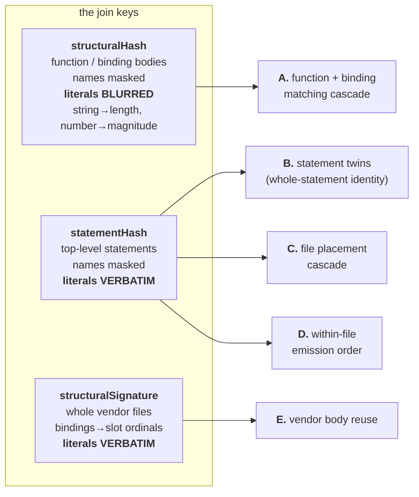
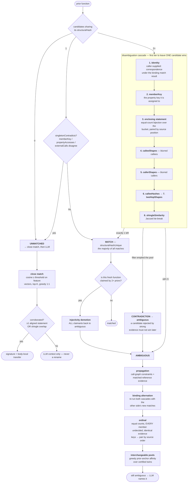
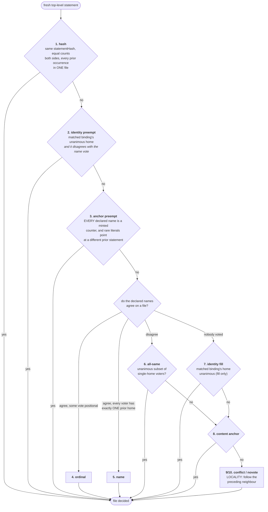
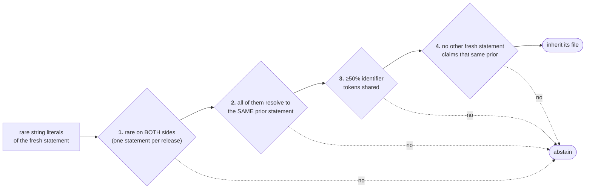
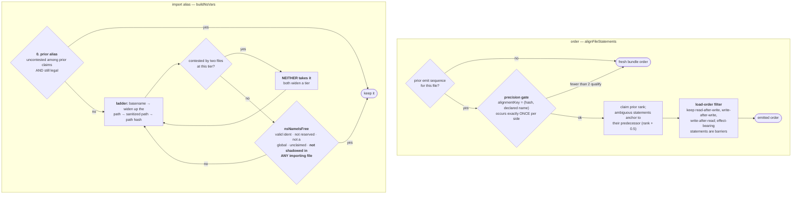

# Matching cascades: every check that pairs a thing to its prior self

Jargon: see the [vocabulary](../experiments/034-eval-harness/VOCABULARY.md).
Naming's execution order is [`naming-pipeline.md`](./naming-pipeline.md); this
document is the **evidence** side — what gets compared, in what order, and what
each tier does when it cannot decide.

One rule runs through all of it: **every tier abstains rather than guesses.** A
wrong match is worse than a missed one — it moves code into the wrong file or
puts a wrong name on a thing, and both cost two diffs instead of one.

## The three hashes everything starts from

They are NOT interchangeable, and the difference is load-bearing.

`structuralHash` **cannot see** a changed endpoint URL or a changed timeout of the
same length — that is why vendor reuse is keyed on `structuralSignature` instead
(exp046). `statementHash` masks every identifier name, so its own docstring warns
that short statements _"collide across unrelated code"_; every consumer of it
carries an equal-count or uniqueness gate for exactly that reason.

## A. The function / binding matching cascade

`src/analysis/fingerprint-index.ts` → `matchFunctions`. Module-level bindings run
the **same** cascade via `buildBindingFingerprintIndex`, alternating rounds with
functions so each side's matches crack the other's ambiguous buckets.

The three guards are the whole precision story: **singleton rejection** (a deleted
helper and an unrelated added helper are alone in their bucket and would
auto-match), **contradiction** (an emptied filter stops the search instead of
falling through to weaker evidence), and **injectivity demotion** (two priors
claiming one fresh function means at most one is right, so neither gets it).

## B. Statement twins

Between the cascade and the transfer phase: a top-level statement whose
`statementHash` occurs **exactly once on each side** is whole-statement identity —
literals included — and outranks everything, including an ordinal exact match that
cross-paired same-shaped siblings. Equal-count family buckets pair by matched-
reference identity keys instead. This is tier 1.1 of the transfer pipeline.

## C. The file placement cascade

`src/split/stable-split.ts` → `PLACEMENT_TIERS`, in evidence-strength order. The
first tier to name a file wins; the last never abstains, so every statement lands
somewhere. `--diagnostics` records which tier placed each statement
(`placement-trail.ts`).

`declaredNames` includes **function parameters**, which is why tier 6 exists: on
215→216 a parameter named `inputData` (39th of 53 prior homes) outvoted the
statement's own two correct votes and sent 149 lines to locality.

The content anchor (tier 8) is four gates, each abstaining:

Gate 3 is not decoration: without it one shared string paired a 5,073-line
statement with a 7-line one and inflated a hop's relocation reading 4.9×.

## D. Within-file emission order, and the require alias

Placement decides _which file_; these decide _where in the file_ and _what the
importer calls it_. Both are pure emit-time functions — deterministic, downstream
of every LLM prompt.

The bolded clause in `nsNameIsFree` is the mechanism exp051 measured and declined
to change: aliases are **one per module tree-wide**, so one importer gaining a
local named `kairosCron` widened the alias in all ~20 importers
(`kairosCron → logTaskEventKairosCron`, ≤256 git lines on 118→119).

## E. Vendor

Vendored libraries are never named, so Bun's local-name reroll would otherwise
churn ~1,540 files a hop. Two checks:

- **body reuse** — if `computeStructuralSignature` matches, write the prior
  release's bytes verbatim. Keyed on the signature, **not** `structuralHash`,
  which would ship last release's endpoints and timeouts.
- **manifest order** — `_bun-modules.json` is emitted in the **prior release's**
  order, with `hashOrdinal` (position within the hash group) as the tie-break.
  Sorting it by any content-derived key was measured and is worse: a changed sort
  key relocates the entry, turning an in-place edit into a delete plus an add.

## Where each tier's decisions are recorded

| surface                             | trail                                  | flag            |
| ----------------------------------- | -------------------------------------- | --------------- |
| function / binding matching         | `resolutionStats` per stage            | always          |
| naming, per identifier              | `strategyTrails` (`strategy-trail.ts`) | `--diagnostics` |
| file placement, per statement       | `placement-trail.ts`                   | `--diagnostics` |
| what a rename pass actually shipped | pass-specific move trail               | pass-specific   |

A pass with an empty trail cannot have moved a KPI, however the KPI reads —
that is measurement-pitfalls rule 11, and it is the reason these exist.
